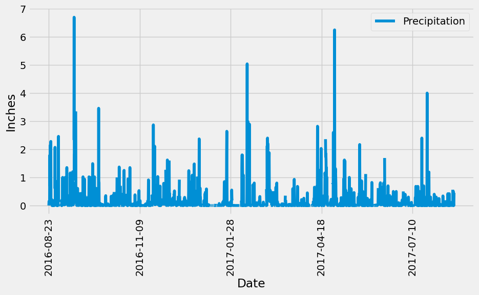
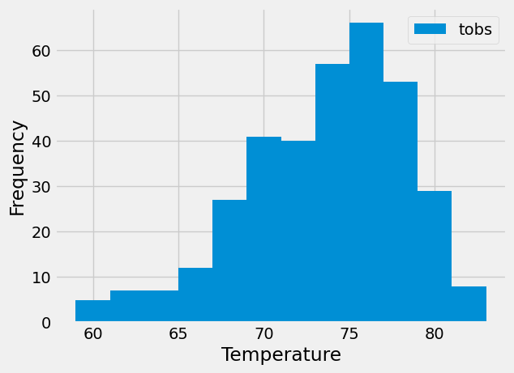

# sqlalchemy-challenge
KU Boot Camp Week 10

# Climate Analysis and Exploration 🌍

## Overview 📖
This project involves a detailed climate analysis and data exploration of Honolulu, Hawaii, using Python, SQLAlchemy, Pandas, and Matplotlib. This analysis will aid in planning a long holiday vacation to the area.

## Repository Contents 📁
- `climate_starter-lee.ipynb`: Jupyter notebook containing all the analysis code.
- `app-lee.py`: Flask API designed to query climate data.
- `action_station_temp_hist.png`: Histogram plot of temperature observations.
- `last_year_prcp.png`: Precipitation analysis plot.
- `hawaii.sqlite`: SQLite database with the climate data.
- `hawaii_measurements.csv`: CSV file containing climate measurements.
- `hawaii_stations.csv`: CSV file containing information about weather stations.

## Parts 📝
1. **Climate Analysis** 🌧️: Perform a detailed climate analysis of Honolulu, Hawaii. Utilize Python, SQLAlchemy ORM, Pandas, and Matplotlib to explore and analyze climate data. This part includes tasks such as precipitation analysis and station analysis, with visualizations showing historical weather patterns.
2. **Climate App** ☀️: Develop a Flask API based on the analysis. This API provides access to climate data through multiple endpoints, allowing users to retrieve JSON-formatted weather statistics. The app serves data like precipitation levels, station information, and temperature observations for effective trip planning.

## Climate Analysis - Part 1 🌡️

### Database Setup 🛠️
This step involves setting up the database connection and preparing the data models:
- **Create Engine**: Use SQLAlchemy's `create_engine()` function to establish a connection to the `hawaii.sqlite` database. This is crucial for enabling subsequent data operations.
- **Automap Base**: Utilize `automap_base()` to reflect the database schema into our code, automatically generating mappings from the database tables to Python classes. This step is essential for interacting with the database in an object-oriented fashion.
- **Class References**: Specifically, references to the `station` and `measurement` classes are saved for easy access to these tables in queries.
- **Session Link**: A session is started using SQLAlchemy to handle transactions, providing a staging zone for all the objects loaded into the database session object. Any change made against the objects in the session won’t be persisted into the database until you call `session.commit()`.
- **Session Closure**: It's important to close the session at the end of the operations to free resources and avoid potential database locks.

### Precipitation Analysis 🌧️
This analysis focuses on precipitation data over the last year:
- **Most Recent Date**: The query first finds the most recent date in the dataset, which is crucial for calculating the date one year ago to limit the data retrieval to the last 12 months.
- **Data Query**: A query retrieves only the date and precipitation values from the dataset for the last year, ensuring that no date variable is passed directly to the query, making the script reusable for future dates.
- **Data Loading**: The results of the query are loaded into a Pandas DataFrame with 'date' and 'prcp' as column headers, facilitating easier analysis and visualization.
- **Sorting**: The DataFrame is sorted by the date to prepare for a sequential visual display.
- **Plotting**: The data is plotted using the DataFrame's `.plot()` method, which visualizes the precipitation over time, with date on the x-axis and precipitation on the y-axis.
- **Statistics**: Summary statistics for the precipitation data are printed using Pandas, providing insights into the central tendency and dispersion of precipitation values.
- **Data Visualization**:
  

### Station Analysis 📊
This section analyzes the station data to understand observation counts and temperature measurements:
- **Station Count**: A query is designed to find the total number of weather stations in the dataset, providing a sense of the dataset's scope.
- **Active Stations**: Another query lists all stations and their observation counts in descending order to identify the most active station. This information is critical for focusing subsequent temperature analysis on the most relevant data.
- **Temperature Stats**: Queries are constructed to find the minimum, maximum, and average temperatures recorded at the most active station, giving a comprehensive view of the temperature range and conditions at that location.
- **TOBS Query**: This query fetches the last 12 months of temperature observation data (TOBS) for the most active station, focusing on the station with the highest observation count to ensure data reliability and relevance.
- **Histogram Plotting**: The results are saved into a DataFrame and then plotted as a histogram with 12 bins to visually represent the distribution of temperature observations over the last year, providing an intuitive understanding of temperature trends and variations.
- **Data Visualization**:
  

## Climate App - Part 2 ☁️

### Flask API Endpoints 📍
To interact with the Flask API, navigate to the following routes:
- `/`: Home page listing all routes.
- `/api/v1.0/precipitation`: JSON representation of the last year's precipitation data.
- `/api/v1.0/stations`: JSON list of all the weather stations.
- `/api/v1.0/tobs`: JSON list of Temperature Observations for the most active station over the past year.
- `/api/v1.0/<start>`: JSON list of temperature statistics from a start date to the present.
- `/api/v1.0/<start>/<end>`: JSON list of temperature statistics between specific start and end dates.

### API SQLite Connection & Landing Page 🌐
The backend setup for the Flask API involves:
- **Database Engine**: Creation of the SQLAlchemy engine connected to the `hawaii.sqlite` database file. This engine serves as the foundation for further data operations.
- **Schema Reflection**: Use of `automap_base()` to reflect the database schema into the ORM, allowing for an object-oriented approach to interact with the database.
- **Table References**: References to the `measurement` and `station` tables are established and saved, providing direct access to these tables for query purposes.
- **Session Management**: A session between the Flask app and the database is created and maintained, ensuring transactions are managed throughout the lifecycle of API calls.
- **Landing Page**: The landing page displays all available API routes, providing users with easy navigation and understanding of the API capabilities.

### API Static Routes 📡
Endpoints providing access to static data:
- **/api/v1.0/precipitation**: Returns a JSON representation where the date is the key and precipitation data is the value. This endpoint specifically returns data from the last year, ensuring users have the latest information.
- **/api/v1.0/stations**: Offers a JSON list of all the stations from the dataset, providing a comprehensive overview of the data collection points.
- **/api/v1.0/tobs**: Delivers JSON formatted temperature observations (TOBS) from the most active station (USC00519281) for the last year, allowing users to analyze the most frequent data points.

### API Dynamic Routes 🛤️
Endpoints that respond to user input:
- **/api/v1.0/<start>**: Accepts a start date from the URL and returns JSON formatted minimum, maximum, and average temperatures from the start date to the end of the dataset. This dynamic input allows users to customize the period of their climate analysis.
- **/api/v1.0/<start>/<end>**: Takes both start and end dates as parameters from the URL and calculates the minimum, maximum, and average temperatures for the given period, providing a targeted analysis over a specific timeframe.

## Conclusion 🏁

Thank you for exploring the Climate Analysis and Exploration project. I hope this tool assists you in understanding the climate patterns of Honolulu, Hawaii, and aids in planning your visits or studies effectively.
